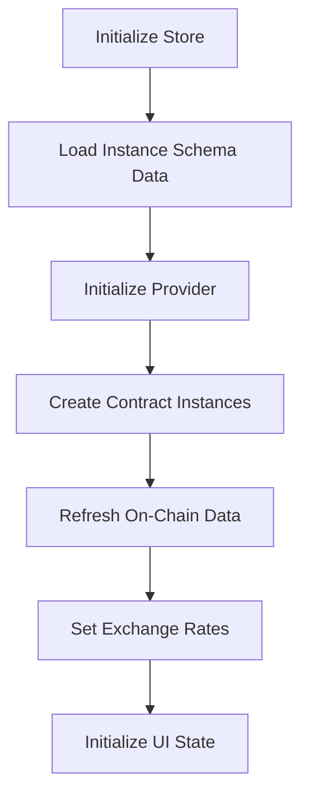

# Data Flow Analysis

This document analyzes data flow patterns from the gachapon-widgets implementation, focusing on state management and data transformation patterns applicable to the BlindMint SDK.

## State Management Architecture

### Pinia Store Pattern

The `claimStore.ts` uses Pinia for centralized state management with reactive computed properties:

```typescript
export const useClaimStore = defineStore('claim', () => {
  // STATE - Reactive refs
  const cost = ref(BigNumber.from(0));
  const total = ref(0);
  const totalMax = ref<number | null>(null);
  const tokensToPurchase = ref(1);
  
  // COMPUTED - Derived state
  const gachaponStatus = computed(() => {
    const now = Date.now();
    if (startDate.value && startDate.value.getTime() > now) {
      return 'not-started';
    } else if (endDate.value && endDate.value.getTime() !== 0 && endDate.value.getTime() < now) {
      return 'ended';
    } else {
      return 'active';
    }
  });

  // ACTIONS - State mutations
  async function refreshOnChainClaim() {
    const onChainData = await contract.value.getClaim(claimType.value);
    total.value = onChainData.total;
    totalMax.value = onChainData.totalMax;
    cost.value = onChainData.cost;
  }

  return { cost, total, gachaponStatus, refreshOnChainClaim };
});
```

## Data Flow Patterns

### 1. Initialization Flow



**Implementation:**
```typescript
async function initialize(instance: SchemaInstanceResponse) {
  // 1. Schema data initialization
  _initializeInstanceSchemaData(instance as SchemaInstanceResponse);
  initializedInstanceData.value = true;

  // 2. Provider initialization
  await _initializeProvider();

  // 3. Contract instance creation
  contract.value = new ClaimExtensionContract(
    networkId.value,
    extensionAddress.value,
    creatorContractAddress.value,
    claimIndex.value,
  );

  // 4. Parallel data fetching
  const promises: any[] = [];
  if (erc20Address.value) {
    erc20Contract.value = new ERC20Contract(networkId.value, erc20Address.value);
    promises.push(erc20Contract.value.getERC20Symbol());
    promises.push(erc20Contract.value.getERC20Decimals());
  }
  promises.push(refreshOnChainClaim());

  const results = await Promise.all(promises);
  
  // 5. Process results and set derived state
  if (erc20Address.value) {
    erc20Symbol.value = results[0];
    erc20Decimals.value = results[1];
  }
}
```

### 2. State Refresh Flow

```typescript
async function refreshWeb3State() {
  isLoadingWeb3State.value = true;

  try {
    // Parallel state updates
    if (hasAllowlist.value) {
      isResetingMerkleData.value = true;
      merkleInfo.value = await fetchMerkleInfo(mintForWallet.value);
      const { mintIndices, merkleProofs } = await _fetchMintIndices(merkleInfo.value);
      claimableMintIndices.value = mintIndices;
      claimableMerkleProofs.value = merkleProofs;
      isResetingMerkleData.value = false;
    }

    refreshOnChainClaim();
    _refreshNumTokensMintedByWallet();
    _refreshAmountApproved();

    // Trigger UI refresh
    window.dispatchEvent(new Event('m-refresh-widgets'));
  } finally {
    isLoadingWeb3State.value = false;
  }
}
```

### 3. Reactive State Dependencies

The store uses Vue's reactive system to create computed dependencies:

```typescript
// Status computation based on dates
const gachaponStatus = computed(() => {
  const now = Date.now();
  if (startDate.value && startDate.value.getTime() > now) {
    return 'not-started';
  } else if (endDate.value && endDate.value.getTime() !== 0 && endDate.value.getTime() < now) {
    return 'ended';
  } else {
    return 'active';
  }
});

// Claimable quantity calculation
const claimableQuantity = computed(() => {
  return _getClaimableQuantity(walletRestriction.value, claimableMintIndices.value);
});

// Price calculations
const finalPrice = computed((): BigNumber => {
  if (hasManifoldFees.value) {
    return priceSubtotal.value.add(manifoldFee.value);
  }
  return priceSubtotal.value;
});
```

## Data Transformation Patterns

### 1. On-Chain to Client Data Mapping

```typescript
// Unix timestamp conversion
function convertDateFromUnixSeconds(unixSeconds: number) {
  if (unixSeconds === 0) {
    return null;
  } else {
    return new Date(unixSeconds * 1000);
  }
}

// Storage protocol URL construction
const metadataURL = computed(() => {
  if (parseOnChainMetadata(metadataLocation.value)) {
    return '';
  }
  return `${StorageProtocolGateway[storageProtocol.value]}${metadataLocation.value}/1`;
});

// Network-specific symbol mapping
if (!erc20Address.value && networkId.value === 10) {
  erc20Symbol.value = 'OETH';
} else if (!erc20Address.value && networkId.value === 137) {
  erc20Symbol.value = 'MATIC';
}
```

### 2. Price Calculation Pipeline

```typescript
// Base price calculation
const priceSubtotal = computed((): BigNumber => {
  if (hasSecondary.value) {
    // Secondary market pricing logic
    let t = 0;
    if (is1155.value && tokenPrices.value) {
      t = tokenPrices.value[floorPriceTokenId.value?.toString() || '0'];
    } else if (floorPrices.value && floorPrices.value.length > 0) {
      for (let i = 0; i < tokensToPurchase.value; i++) {
        t = floorPrices.value[i][1] + t;
      }
    }
    return parseEther(t.toFixed(18));
  } else if (isNaN(tokensToPurchase.value) || !tokensToPurchase.value) {
    return BigNumber.from(0);
  }
  return cost.value.mul(tokensToPurchase.value);
});

// Fee calculation
const manifoldFee = computed((): BigNumber => {
  if (isNaN(tokensToPurchase.value) || !tokensToPurchase.value) {
    return BigNumber.from(0);
  }
  let feeToUse = FEE_PER_MINT;
  if (networkId.value === 137) {
    feeToUse = MATIC_FEE_PER_MINT;
  }
  return feeToUse.mul(tokensToPurchase.value);
});

// Final price with fees
const finalPrice = computed((): BigNumber => {
  if (hasManifoldFees.value) {
    return priceSubtotal.value.add(manifoldFee.value);
  }
  return priceSubtotal.value;
});
```

### 3. Fiat Price Conversion

```typescript
// Exchange rate application
const finalPriceUsdConversion = computed((): number => {
  if (finalPrice.value.eq(0)) {
    return 0;
  }
  if (!ethToUsdRate.value) {
    return 0;
  }
  if (erc20Address.value) {
    return (
      erc20ToUsdRate.value * +formatUnits(finalPrice.value, erc20Decimals.value) +
      manifoldFeeUsdConversion.value
    );
  }
  return ethToUsdRate.value * +formatEther(finalPrice.value);
});

// Fiat price management
function updateFiatPricesFromExternalWidget(
  priceSubtotalWithManifoldFees: BigNumber,
  finalPrice: BigNumber,
) {
  if (isFreeClaim.value && !hasSecondary.value) {
    priceSubtotalInFiat.value = BigNumber.from(0);
  } else if (_hasFixedFiatCost.value) {
    priceSubtotalInFiat.value = costInFiat.value.mul(tokensToPurchase.value);
  } else {
    priceSubtotalInFiat.value = priceSubtotalWithManifoldFees.sub(manifoldFeeInFiat.value);
  }

  processingFeesInFiat.value = finalPrice
    .sub(manifoldFeeInFiat.value)
    .sub(priceSubtotalInFiat.value);
  finalPriceInFiat.value = finalPrice;
  loadingFiatPrices.value = false;
}
```

## Event-Driven Updates

### 1. Provider Event Handling

```typescript
setProviderEventsHandler(async () => {
  const eth = window.ManifoldEthereumProvider;
  const address = eth.selectedAddress();
  const chainId = eth.chainId();

  // Reset bridge state if wallet address changes
  if (walletAddress.value !== address) {
    resetBridgeState();
  }

  // Update network-specific state
  if (chainId === networkId.value) {
    try {
      claimNetworkGasPrice.value = await currentProvider?.getGasPrice();
    } catch (e) {
      console.log('error getting gas price', e);
    }
  }

  walletAddress.value = address;
  activeNetwork.value = chainId || networkId.value;
});
```

### 2. Reactive Watchers

```typescript
// Watch for wallet changes and refresh state
watch(mintForWallet, () => {
  if (!mintForWallet.value || !initialized.value) {
    return;
  }
  refreshWeb3State();
});

// Watch for network changes
watch(activeNetwork, () => {
  if (!activeNetwork.value || !initialized.value) {
    return;
  }
  refreshWeb3State();
});

// Watch for price changes and calculate gas
watch(
  [finalPrice, claimNetworkGasPrice],
  async () => {
    const provider = window.ManifoldEthereumProvider.provider();
    if (!walletAddress.value || !provider || !claimNetworkGasPrice.value) {
      return;
    }
    try {
      finalPriceWithGas.value = finalPrice.value.add(
        claimNetworkGasPrice.value.mul(
          MINT_GAS_ESTIMATE + PERCENTAGE_GAS_BUFFER * MINT_GAS_ESTIMATE,
        ),
      );
    } catch (e) {
      console.log('error getting gas price', e);
    }
  },
  { immediate: true, deep: true },
);
```

## Data Persistence Patterns

### 1. Loading States

```typescript
const isLoadingWeb3State = ref(false);
const isResetingMerkleData = ref(false);
const loadingFiatPrices = ref(true);

// Loading state management in async operations
async function refreshWeb3State() {
  isLoadingWeb3State.value = true;
  try {
    // ... async operations
  } finally {
    isLoadingWeb3State.value = false;
  }
}
```

### 2. Error State Management

```typescript
const bridgeError = ref<string>('');
const delegationError = computed(() => /* error computation */);

function setBridgeState(bridging: boolean, error?: string) {
  isBridging.value = bridging;
  bridgeError.value = error || '';
}
```

## Key Patterns for BlindMint SDK

1. **Centralized State Management**: Single store managing all BlindMint state
2. **Reactive Computed Properties**: Automatic derivation of dependent values
3. **Parallel Data Fetching**: Efficient initialization with Promise.all
4. **Event-Driven Updates**: Provider changes trigger state refresh
5. **Loading State Management**: Clear loading indicators for async operations
6. **Error Boundary Patterns**: Graceful error handling and user feedback
7. **BigNumber Precision**: All financial calculations use BigNumber
8. **Network-Aware State**: Different behavior based on network ID
9. **Caching Strategies**: Lazy initialization and state persistence
10. **Type-Safe Transformations**: Strong typing throughout data pipeline