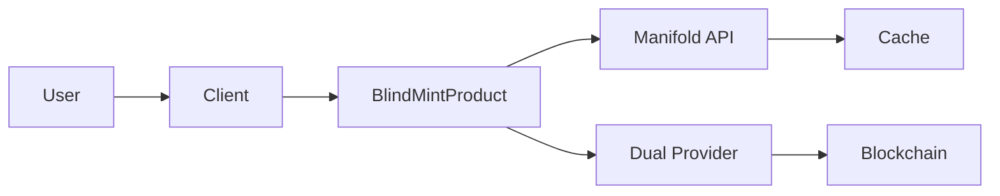

# System Discovery Analysis - CON-2729 BlindMint Implementation

## 🔍 Discovery Summary

- **System Type**: TypeScript SDK for NFT Minting (Gacha-style)
- **Complexity Level**: High (Blockchain + Multi-network + Dual-provider)
- **Architecture Pattern**: Factory-based with Repository Pattern
- **Discovery Confidence**: High (5 agents analyzed, cross-validated)
- **Current Status**: ❌ NOT PRODUCTION READY (Critical blockers identified)

## 🏗️ Current Architecture

### Core Components
```
src/
├── client/          → Factory for product creation
├── products/        → BlindMint implementation (140+ line constructor)
├── api/            → Manifold API client with caching
├── utils/          → Dual-provider & contract factories
├── types/          → Comprehensive TypeScript definitions
└── config/         → Network, provider, cache configurations
```

### Key Architectural Patterns
1. **Dual-Provider Pattern**: Primary (wallet) + Bridge (RPC) with automatic failover
2. **Factory Pattern**: Pervasive use of factories for flexibility and testability
3. **Type-Safe Discriminated Unions**: Product type resolution with type guards
4. **Resilient API Pattern**: Retry logic, exponential backoff, cache-first strategy

### Data Flow Architecture


## 🔗 Dependencies Discovered

### Critical Dependencies
- **ethers.js 5.7.0** - Core blockchain library (HIGH coupling risk)
- **@manifoldxyz/manifold-provider-client** - Provider abstraction
- **@manifoldxyz/studio-apps-client** - Preview enhancement (BROKEN)

### External Services
- **Manifold API**: `apps.api.manifoldxyz.dev` - Instance data
- **Multi-network RPCs**: Ethereum, Base, Polygon, Optimism, Shape
- **Smart Contracts**: BlindMint extension contracts on each network

### Dependency Risk Matrix
| Dependency | Coupling | Risk | Impact |
|------------|----------|------|---------|
| ethers.js 5.7.0 | HIGH | HIGH | Breaking changes in v6 |
| Manifold API | MEDIUM | LOW | Graceful fallback exists |
| Studio Apps | LOW | MEDIUM | Optional but broken |
| RPC Providers | MEDIUM | MEDIUM | Dual-provider mitigates |

## 📋 Patterns & Conventions

### Naming Conventions
- **Files**: kebab-case (`blindmint.ts`, `provider-factory.ts`)
- **Variables**: camelCase (`instanceData`, `onchainData`)
- **Types/Interfaces**: PascalCase (`BlindMintProduct`, `GachaConfig`)
- **Constants**: SCREAMING_SNAKE_CASE (`NETWORK_CONFIGS`)

### Code Patterns
- **Async/Await**: Consistent throughout with Promise.all for parallel ops
- **Error Handling**: Custom error classes with context objects
- **Factory Functions**: Preferred over direct instantiation
- **Type Guards**: Used for discriminated union resolution

### Anti-patterns Identified
- **140+ line constructor** - Needs extraction to strategies
- **Heavy mocking in tests** - May miss integration issues
- **Mixed type imports** - Inconsistent use of `import type`
- **Console.log usage** - Should use structured logging

## 📚 Business Context

### BlindMint Product Model
- **Purpose**: Gacha-style random NFT minting with tier probabilities
- **Tiers**: Common, Rare, Legendary with configurable odds
- **Revenue**: Platform fee from contract's MINT_FEE() function
- **Flow**: Purchase → Random selection → Immediate reveal

### User Journey
1. Browse collections via SDK integration
2. Check eligibility and allocations
3. Prepare purchase (gas estimation, cost calculation)
4. Execute transaction (ERC20 approval + mint if needed)
5. Receive random NFT based on tier probabilities

### Business Rules
- Global supply limits enforced on-chain
- Per-wallet limits configurable (0 = unlimited)
- Start/end dates determine status (upcoming → active → completed)
- No refunds after successful mint

## 🚦 System Health

### Critical Issues ❌
1. **65+ TypeScript compilation errors** - Build completely broken
2. **Missing ABI files** - GachaExtensionERC1155ABIv1/v2 not found
3. **Type exports broken** - BlindMintProduct not exported
4. **8/89 tests failing** - Integration tests broken
5. **10 security vulnerabilities** - High/critical npm audit findings

### Architecture Quality ✅
- Well-structured dual-provider pattern
- Comprehensive error handling
- Good separation of concerns
- Type-safe interfaces

### Operational Readiness
- **Build**: ❌ Fails with 65+ errors
- **Tests**: ⚠️ 91% passing (8 failures)
- **Security**: ❌ 10 high/critical vulnerabilities
- **Documentation**: ⚠️ Partial (multiple TODOs)
- **Production Config**: ❌ Missing

## 🎯 Auto-Discovered Type Contracts

### Critical Contracts (Must Build First)
```typescript
// Used by 3+ components
interface GachaConfig {
  tiers: TierConfig[];
  poolSize: number;
  revealImmediately: boolean;
}

interface BlindMintInstanceData {
  instanceId: string;
  publicData: BlindMintPublicData;
  contractAddress: Address;
  networkId: NetworkId;
}

interface MultiStepTransaction {
  steps: TransactionStep[];
  estimatedGas: bigint;
  totalCost: Money;
}
```

### Important Contracts (Stage 2)
- **MintValidation**: Pre-flight eligibility checks
- **TransactionReceipt**: Standardized blockchain responses

### Integration Contracts (External)
- **ManifoldAPIResponse**: External API data format
- **StudioAppsPreview**: Enhancement service interface
- **BlockchainProvider**: RPC provider configuration

## 🔄 Recommended Architecture Changes

### Immediate (Blockers)
1. **Restore missing ABI files** - Check Solidity contracts or generate
2. **Fix type exports** - Export BlindMintProduct from products/index.ts
3. **Security patches** - Update vulnerable dependencies

### Short-term (This Week)
1. **Extract constructor logic** - Implement initialization strategies
2. **Complete TODO implementations** - Query wallet minted, fetch variations
3. **Fix Studio Apps integration** - Update to compatible version

### Long-term (This Month)
1. **Add integration tests** - End-to-end purchase flow testing
2. **Implement structured logging** - Replace console.log
3. **Create production configuration** - Environment-specific settings

## ⚠️ Risk Factors Identified

### High Risk
- **Missing ABIs block everything** - No compilation possible
- **ethers.js v6 migration** - Major breaking changes ahead
- **No production configuration** - Can't deploy safely

### Medium Risk
- **Studio Apps version mismatch** - Enhancement features broken
- **Complex provider switching** - Timing issues possible
- **Heavy test mocking** - May miss real integration issues

### Low Risk
- **Constructor complexity** - Maintainability issue
- **Cache invalidation** - Could be more sophisticated
- **Gas estimation** - 25% buffer may be insufficient

## 💡 Strategic Insights

### The Architecture Paradox
**Sophisticated design undermined by incomplete implementation**. The dual-provider pattern and factory architecture show experienced blockchain engineering, but missing files and broken tests suggest rushed delivery or incomplete handoff.

### The Revenue Architecture
The platform fee (from MINT_FEE) reveals a B2B SaaS model where Manifold succeeds when creators succeed. Gacha mechanics create engagement loops that increase total mints and revenue.

### The Platform Evolution Path
Factory patterns and modular architecture position this as foundation for broader creator platform:
- Current: BlindMint gacha NFTs
- Near-term: Additional product types
- Long-term: Full creator economy infrastructure

### Technical Excellence vs Delivery Pressure
The codebase reveals tension between doing things right (architecture) and shipping quickly (implementation). This is actually positive - the foundation is solid, just needs completion.

## 🎬 Next Steps

1. **Day 1**: Fix critical blockers (ABIs, type exports)
2. **Day 2**: Complete implementation and tests
3. **Day 3**: Security, optimization, and documentation

With 2-3 days of focused work, this transforms from broken implementation to production-ready SDK with competitive advantages in developer experience and reliability.