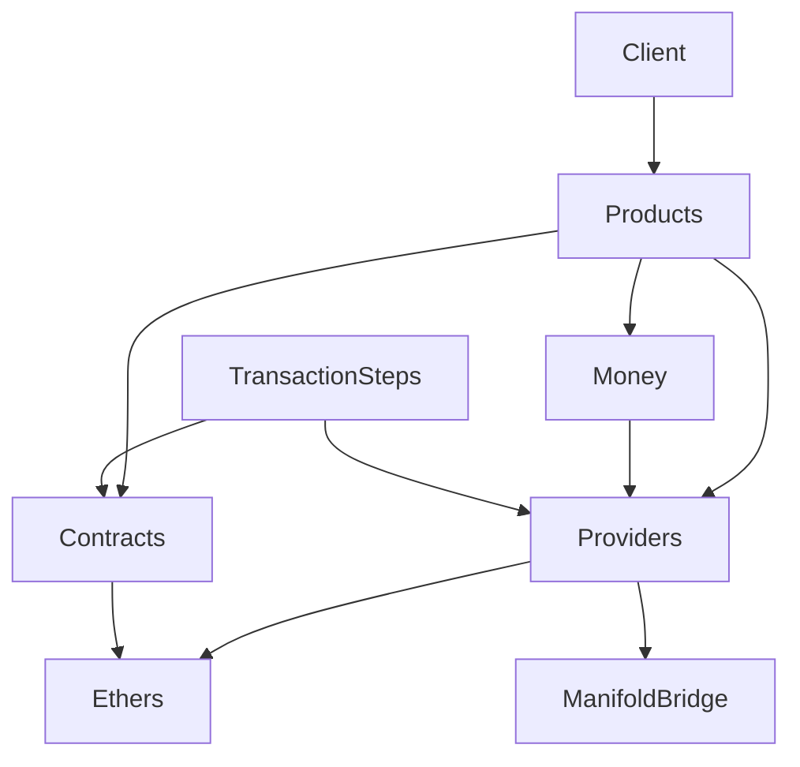

# System Discovery Analysis - CON-2740

## 🔍 Discovery Summary

- **System Type**: TypeScript SDK for NFT marketplace integration
- **Complexity Level**: Complex - Multi-library provider abstraction
- **Architecture Pattern**: Layered architecture with factory patterns
- **Discovery Confidence**: High - Comprehensive analysis across 5 discovery agents

## 🏗️ Current Architecture

### System Components
```yaml
client_layer:
  - ManifoldClient: Main SDK entry point
  - Product factories: getProduct, getProductsByWorkspace
  
product_layer:
  - BlindMintProduct: Gacha-style NFT implementation
  - Two-phase pattern: preparePurchase → execute
  - Money class: Currency abstraction
  
provider_layer:
  - CustomProviderFactory: Primary provider creation
  - ManifoldBridgeProvider: Fallback RPC provider
  - Network configurations: 5 chains supported
  
transaction_layer:
  - TransactionStep: Transaction orchestration
  - Execute functions: Embedded in step definitions
  - Sequential execution: Multi-step transaction flow
  
utility_layer:
  - ContractFactory: Smart contract instantiation
  - Gas estimation: Transaction cost prediction
  - Balance checking: Fund verification
```

### Data Flow Architecture
```
User Request → ManifoldClient → Product Instance
                                      ↓
                              preparePurchase()
                                      ↓
                              Cost Calculation (Money)
                                      ↓
                              PreparedPurchase
                                      ↓
                              purchase(account)
                                      ↓
                              TransactionStep.execute()
                                      ↓
                              Provider → Blockchain
```

## 🔗 Dependencies Discovered

### External Dependencies
```json
{
  "critical": {
    "ethers": "5.7.0",
    "@manifoldxyz/manifold-provider-client": "^0.2.0",
    "@manifoldxyz/studio-apps-client": "^3.5.2"
  },
  "utility": {
    "@manifoldxyz/js-ts-utils": "^7.4.2"
  }
}
```

### Dependency Graph


### Service Dependencies
- **RPC Providers**: LlamaRPC (primary), ManifoldBridge (fallback)
- **API Services**: Manifold Studio Apps API, Coinbase price API
- **Networks**: Ethereum, Polygon, Optimism, Arbitrum, Base

## 📋 Patterns & Conventions

### Established Patterns
1. **Factory Pattern**: Provider and contract creation
2. **Two-Phase Transaction**: Prepare → Execute separation
3. **Error Hierarchy**: ClientSDKError with specific error codes
4. **Currency Abstraction**: Money class for all value operations
5. **Async/Await**: All blockchain operations are async
6. **TypeScript-First**: Full type safety with inference

### Naming Conventions
```typescript
// Interfaces: PascalCase with 'I' prefix for adapters
interface IProviderAdapter { }

// Types: PascalCase
type NetworkInfo = { }

// Functions: camelCase
async function preparePurchase() { }

// Constants: SCREAMING_SNAKE_CASE
const DEFAULT_GAS_BUFFER = 1.2;

// File naming: kebab-case
// provider-adapter.ts, network-config.ts
```

### Anti-Patterns to Avoid
- Direct provider access outside adapter layer
- Synchronous blockchain operations
- Hardcoded network configurations
- Mixing library-specific types with universal types
- Tight coupling between products and providers

## 📚 Business Context

### Core Business Requirements
The SDK enables **headless purchasing** of Manifold NFT products, requiring:
- Multi-wallet support (MetaMask, WalletConnect, hardware wallets)
- Multi-chain transactions (5 networks)
- Multi-library compatibility (ethers5, ethers6, viem)
- Two-phase purchase flow for safety and transparency

### Domain Rules
1. **Purchase Eligibility**: Address-based allowlists and token requirements
2. **Gas Management**: Support buffers and custom gas strategies
3. **Multi-Step Transactions**: ERC-20 approvals before minting
4. **Cross-Chain Support**: Network switching during purchase flow

### Compliance Requirements
- Transaction traceability with receipts
- Address validation before transactions
- Network verification for security
- Balance checks to prevent failures

## 🚦 System Health

### Critical Issues
- **Build Failure**: Money class export mismatch blocking compilation
- **TypeScript Errors**: 46+ type errors preventing clean build
- **Test Failures**: 15/78 tests failing, primarily BlindMint related
- **Security Vulnerabilities**: 10 npm audit issues including critical ones

### Performance Metrics
- **Provider Timeout**: 10 seconds default
- **Retry Logic**: 3 attempts for RPC calls
- **Gas Estimation**: 20% buffer by default
- **Network Latency**: Variable based on RPC provider

### Operational Concerns
- No monitoring or observability infrastructure
- Basic error handling without recovery strategies
- Limited retry mechanisms for network failures
- No caching for frequently accessed data

## 🎯 Auto-Discovered Type Contracts

### Critical Contracts (Must Build First)

#### IProviderAdapter
- **Reason**: Abstracts provider differences across libraries
- **Used By**: ManifoldBridgeProvider, CustomProviderFactory, all products
- **Fields**: getProvider, getNetwork, switchNetwork, sendTransaction, estimateGas
- **Priority**: CRITICAL

#### UniversalTransactionRequest/Response
- **Reason**: Normalizes transaction interfaces across all libraries
- **Used By**: TransactionStep, preparePurchase, execute, all adapters
- **Fields**: to, value, data, gasLimit, hash, status, gasUsed
- **Priority**: CRITICAL

#### IAccountAdapter
- **Reason**: Primary interface for CON-2740 requirements
- **Used By**: preparePurchase, step.execute, BlindMint operations
- **Fields**: address, sendTransaction, getBalance, getConnectedNetworkId, switchNetwork
- **Priority**: CRITICAL

### Important Contracts (Stage 2)

#### NetworkAdapter
- **Reason**: Standardizes network configuration and management
- **Used By**: Network switching, provider initialization, RPC failover
- **Fields**: chainId, name, rpcUrls, createProvider, validateChainId
- **Priority**: IMPORTANT

#### LibraryBridge<T>
- **Reason**: Type-safe conversion between library-specific and universal types
- **Used By**: Provider factory, adapter initialization, type conversion
- **Fields**: toUniversalTransaction, fromUniversalTransaction, wrapProvider
- **Priority**: IMPORTANT

### Integration Contracts (External)

#### ManifoldAPIResponse
- **Reason**: Type safety for Studio Apps API responses
- **Used By**: Product data fetching, instance metadata
- **Priority**: NICE-TO-HAVE

#### RPCProviderConfig
- **Reason**: Configuration for external RPC providers
- **Used By**: Provider factory, network configuration
- **Priority**: NICE-TO-HAVE

## 🔄 Recommended Architecture Changes

### Immediate Changes (Before CON-2740)
1. **Fix Money Class Export**: Resolve build-breaking export issue
2. **Stabilize Type System**: Fix TypeScript errors for clean compilation
3. **Restore Test Suite**: Fix failing tests for confidence in changes

### CON-2740 Implementation Architecture
```
┌─────────────────────────────────────────┐
│         Application Layer               │
│    (preparePurchase, step.execute)      │
└────────────────┬────────────────────────┘
                 │
┌────────────────▼────────────────────────┐
│         Account Adapter Layer           │
│   (IAccountAdapter implementation)      │
└────────────────┬────────────────────────┘
                 │
┌────────────────▼────────────────────────┐
│        Provider Adapter Layer           │
│   (IProviderAdapter abstraction)        │
└────────────────┬────────────────────────┘
                 │
┌────────────────▼────────────────────────┐
│         Library Bridge Layer            │
│  (ethers5 | ethers6 | viem bridges)     │
└────────────────┬────────────────────────┘
                 │
┌────────────────▼────────────────────────┐
│      Native Provider Libraries          │
│    (ethers v5, ethers v6, viem)         │
└─────────────────────────────────────────┘
```

### Long-term Improvements
1. **Observability**: Add logging and monitoring infrastructure
2. **Caching Layer**: Cache frequently accessed blockchain data
3. **Enhanced Retry**: Implement exponential backoff and circuit breakers
4. **Provider Pool**: Multiple RPC providers with automatic failover
5. **Type Generation**: Auto-generate types from contract ABIs

## ⚠️ Risk Factors Identified

### High Risk
- **Build Instability**: Current build failures block all development
- **Type System Issues**: TypeScript errors could cause runtime failures
- **Test Coverage Gaps**: 19% test failure rate indicates fragility

### Medium Risk
- **Tight Ethers Coupling**: 15+ files directly depend on ethers v5
- **Security Vulnerabilities**: Outdated dependencies with known issues
- **Limited Error Recovery**: Basic error handling without retry strategies

### Low Risk
- **Performance**: Current implementation performs adequately
- **Documentation**: Reasonable documentation coverage exists
- **Network Support**: All required networks are configured

### Mitigation Strategies
1. **Phase 1 Stabilization**: Fix critical issues before new development
2. **Incremental Migration**: Adapter pattern allows gradual transition
3. **Comprehensive Testing**: Test each adapter independently
4. **Fallback Strategy**: Maintain ethers v5 as primary until stable