# Intelligent Execution Plan - CON-2729 BlindMint Implementation

## 📊 Plan Overview

- **Total Stages**: 6 major stages, 12 sub-stages
- **Estimated Time**: 2.5-3 days (19-23 hours)
- **Parallel Opportunities**: 5 identified (marked with 🔄)
- **Critical Path**: Stage 1.1 → 1.2 → 2.1 → 3.1 → 6
- **Team Size**: 1-2 developers optimal

## 🚨 CRITICAL: Must-Follow Patterns

### Provider Usage Pattern (CRITICAL)
```typescript
// READ operations: Use RPC provider from createClient config, fallback to bridge
const provider = this.rpcProvider || this.bridgeProvider;
const data = await contract.getClaim(...);

// WRITE operations: ALWAYS use AccountProvider passed in method params
async purchase(params: PurchaseParams) {
  const tx = await contract.connect(params.account).mintReserve(...);
}
```

### Contract Methods (from gachapon-widgets)
- Use `getClaim(creatorContract, claimIndex)` for onchain data
- Use `getTotalMints(wallet, creatorContract, claimIndex)` for wallet count
- Use `mintReserve()` for ALL minting (both ETH and ERC20)
- Platform fee from `contract.MINT_FEE()` function

### Data Caching
- Cache onchain data indefinitely (only refresh with force=true)
- Token variations count comes from onchain gachaData.tokenVariations

### Error Codes (use standard ClientSDKError codes)
- `INVALID_INPUT` - Invalid address/quantity
- `NOT_ELIGIBLE` - Wallet not eligible
- `LIMIT_REACHED` - Wallet limit exceeded
- `SOLD_OUT` - Product sold out
- `NOT_STARTED`/`ENDED` - Outside sale window
- `INSUFFICIENT_FUNDS` - Not enough ETH/tokens
- `TRANSACTION_FAILED` - Smart contract revert
- `ESTIMATION_FAILED` - Gas estimation failed

## 🚨 Foundation Stage: Critical Fixes (Day 1, 4 hours)

### Stage 1.1: Verify/Restore ABI Files ⛔ BLOCKER
**Time**: 1-2 hours | **Agent**: `software-engineer` + `backend-engineer` 🔄

```typescript
// Required ABI files (should already exist in src/abis/):
src/abis/GachaExtensionERC1155ABIv1.ts  // V1: 0x53c37ccc1c48f63bd35ffc93952d0880d7529b9e
src/abis/GachaExtensionERC1155ABIv2.ts  // V2: 0x40ae3553a2dbbe463f84da97bda5607cfd03b40d

// Update imports:
// src/abis/index.ts
export { default as GachaExtensionERC1155ABIv1 } from './GachaExtensionERC1155ABIv1';
export { default as GachaExtensionERC1155ABIv2 } from './GachaExtensionERC1155ABIv2';
```

**Tasks**:
- [ ] Check if ABIs exist in Solidity contracts repo
- [ ] If not found, extract from deployed contracts on Etherscan
- [ ] Generate TypeScript ABI files with proper typing
- [ ] Update import paths in src/abis/index.ts
- [ ] Verify structure matches ContractFactory expectations

**Success Criteria**: `npm run typecheck` shows ABI-related errors resolved

### Stage 1.2: Fix Type Exports ⛔ BLOCKER  
**Time**: 1 hour | **Agent**: `software-engineer` | **Depends on**: 1.1

```typescript
// src/products/index.ts - Add missing exports:
export type { BlindMintProduct } from './blindmint';
export type { GachaConfig } from '../types/blindmint';
export { isBlindMintProduct } from './blindmint';
```

**Tasks**:
- [ ] Export BlindMintProduct interface from products/index.ts
- [ ] Export supporting types (GachaConfig)
- [ ] Fix discriminated union type exports
- [ ] Ensure all public types are accessible
- [ ] Run full TypeScript compilation check

**Success Criteria**: `npm run build` completes with 0 errors

## 🔧 Implementation Stage: Core Functionality (Day 1-2, 8 hours)

### Stage 2.1: Complete BlindMint Implementation
**Time**: 3-4 hours | **Agents**: `frontend-engineer` + `backend-engineer` 🔄 | **Depends on**: 1.2

```typescript
// TODOs to implement - matching official SDK documentation:
async getAllocations({ recipientAddress }: AllocationParams): Promise<AllocationResponse> {
  // Fetch onchain data first (caches automatically)
  const onchainData = await this.fetchOnchainData();
  
  // Query wallet minted count from contract using getTotalMints
  const mintedCount = await this.contract.getTotalMints(
    recipientAddress,
    this.creatorContract,
    this.claimIndex
  );
  
  // Calculate eligibility (0 walletMax = unlimited)
  const isEligible = onchainData.walletMax === 0 || mintedCount < onchainData.walletMax;
  const remaining = onchainData.walletMax === 0
    ? Number.MAX_SAFE_INTEGER
    : onchainData.walletMax - mintedCount;
  
  return {
    isEligible,
    quantity: Math.min(remaining, onchainData.totalSupply - onchainData.totalMinted),
    reason: !isEligible ? 'Wallet limit reached' : undefined
  };
}

// Additional methods from SDK documentation:
async getStatus(): Promise<ProductStatus> {
  const now = Date.now();
  const onchainData = await this.fetchOnchainData();
  
  if (onchainData.startDate && now < onchainData.startDate.getTime()) {
    return 'upcoming';
  }
  if (onchainData.endDate && now > onchainData.endDate.getTime()) {
    return 'ended';
  }
  if (onchainData.totalMinted >= onchainData.totalSupply) {
    return 'sold_out';
  }
  return 'active';
}

async getMetadata(): Promise<ProductMetadata> {
  return {
    name: this.data.publicData.title,
    description: this.data.publicData.description
  };
}

async getPreviewMedia(): Promise<Media> {
  const asset = this.data.publicData.asset;
  return {
    image: asset?.image,
    imagePreview: asset?.imagePreview,
    animation: asset?.animation,
    animationPreview: asset?.animationPreview
  };
}
```

**Tasks**:
- [ ] Implement wallet minted count query using contract.getTotalMints()
- [ ] Remove token variations method (not needed)
- [ ] Calculate tier probabilities from pool data
- [ ] Use RPC provider from createClient config for READ operations, fallback to bridge
- [ ] Use AccountProvider passed in method params for WRITE operations only
- [ ] Implement caching with force parameter (cache indefinitely unless force=true)
- [ ] Accept previewData in constructor from client.getProduct()
- [ ] Implement getStatus() method (check dates then supply)
- [ ] Implement getMetadata() method (from publicData.title/description)
- [ ] Implement getPreviewMedia() method (from publicData.asset)
- [ ] Add 30% gas buffer to all estimates (per PERCENTAGE_GAS_BUFFER in gachapon-widgets)
- [ ] Include platform fee from contract's MINT_FEE() in cost calculations
- [ ] Validate all addresses with ethers.utils.isAddress
- [ ] Use mintReserve() for ALL minting
- [ ] Return proper Order object from purchase() and step.execute()

**Success Criteria**: All TODO comments replaced with working code

### Stage 2.2: Fix Studio Apps Integration
**Time**: 2-3 hours | **Agent**: `backend-engineer` | **Depends on**: 2.1

```typescript
// Fix preview enhancement (optional):
// Note: Studio Apps Client is optional for preview enhancement
// previewData should be passed from client.getProduct() when available
try {
  // Studio client setup is optional
  if (config.api?.studioAppsUrl) {
    // Would initialize StudioAppsClient here if available
  }
  return { ...baseData, previewData };
} catch (error) {
  // Graceful degradation - preview is optional
  console.warn('Preview enhancement failed, continuing without preview', error);
  return baseData;
}
```

**Tasks**:
- [ ] Studio Apps Client is optional - can be commented out if not available
- [ ] Fix import and initialization issues
- [ ] Add proper error boundaries for optional features
- [ ] Implement fallback when service unavailable
- [ ] Test with and without preview data

**Success Criteria**: Preview enhancement works when available, degrades gracefully

## ✅ Quality Assurance Stage (Day 2, 4 hours)

### Stage 3.1: Fix Failing Tests
**Time**: 2-3 hours | **Agent**: `qa-engineer` | **Depends on**: 2.2

```bash
# Current state: 8/89 tests failing
# Target: 89/89 tests passing

npm test -- --run
# Fix each failing test systematically
```

**Tasks**:
- [ ] Fix mock setup for new ABI structure
- [ ] Update test expectations for completed TODOs
- [ ] Add integration tests for dual-provider failover
- [ ] Add tests for ERC20 approval flow
- [ ] Ensure 100% test coverage for public APIs

**Success Criteria**: `npm test` shows 89/89 tests passing

### Stage 3.2: Security Patches 🔄
**Time**: 2 hours | **Agent**: `security-auditor` | **Parallel with**: 3.1

```bash
# Current: 10 high/critical vulnerabilities
npm audit
# Fix with:
npm audit fix --force
# Manual fixes for breaking changes
```

**Tasks**:
- [ ] Run npm audit and document vulnerabilities
- [ ] Update elliptic and other crypto libraries
- [ ] Review all uses of eval() or dynamic code execution
- [ ] Audit private key handling patterns
- [ ] Add security best practices documentation

**Success Criteria**: `npm audit` shows 0 high/critical vulnerabilities

## 🚀 Optimization Stage (Day 2-3, 6 hours)

### Stage 4.1: Refactor Constructor
**Time**: 3 hours | **Agent**: `software-engineer` | **Depends on**: 3.1

```typescript
// Current: 140+ lines constructor
// Target: <50 lines with simple private methods

class BlindMintProduct {
  constructor(
    instanceData: InstanceData,
    config: ClientConfig,
    previewData?: PreviewData // Fetched from Studio Apps API via client.getProduct()
  ) {
    // Simple initialization matching docs structure
    this.id = instanceData.id;
    this.data = instanceData;
    this.previewData = previewData || this._extractPreviewData(instanceData.publicData);
    
    // Setup internal services using private methods (<50 lines total)
    this._setupProviders(config);
    this._setupContracts();
    this._setupStudioClient(config);
    
    // Optionally fetch onchain data
    if (config.includeOnchainData !== false) {
      this.fetchOnchainData().catch(err => console.warn('Onchain data fetch failed:', err));
    }
  }
  
  // Private setup methods for clean organization
  private _setupProviders(config: ClientConfig) { /* ... */ }
  private _setupContracts() { /* ... */ }
  private _setupStudioClient(config: ClientConfig) { /* ... */ }
}
```

**Tasks**:
- [ ] Extract initialization logic to private methods (_setupProviders, _setupContracts, etc.)
- [ ] Add previewData parameter to constructor
- [ ] Reduce constructor to <50 lines
- [ ] Maintain backward compatibility
- [ ] Add unit tests for setup methods

**Success Criteria**: Constructor reduced to <50 lines (currently ~30 lines), all tests still pass

### Stage 4.2: Performance Optimization 🔄
**Time**: 3 hours | **Agent**: `performance-optimizer` | **Parallel with**: 4.1

```typescript
// Optimization targets:
// - Provider switching: <500ms
// - Cache hit rate: >80%
// - API calls: minimize with batching
// - Gas estimation: accurate within 10%
```

**Tasks**:
- [ ] Profile provider switching with performance marks
- [ ] Implement smarter cache invalidation
- [ ] Batch API calls where possible
- [ ] Add connection pooling for providers
- [ ] Optimize BigInt operations

**Success Criteria**: Provider failover <2s, cache hit rate >80%

## 📝 Documentation Stage (Day 3, 3 hours)

### Stage 5.1: Complete Documentation
**Time**: 2 hours | **Agent**: `documentation-scanner` | **Depends on**: 4.1

```markdown
# Documentation sections to complete:
1. Integration Guide
2. API Reference (JSDoc)
3. Troubleshooting Guide
4. Migration Guide (for v1 users)
5. Best Practices
```

**Tasks**:
- [ ] Document all public methods with JSDoc
- [ ] Create step-by-step integration guide
- [ ] Add common error solutions
- [ ] Document provider configuration best practices
- [ ] Update examples with real-world usage

**Success Criteria**: 100% public API documented, examples run successfully

### Stage 5.2: Deployment Preparation 🔄
**Time**: 1 hour | **Agent**: `backend-engineer` | **Parallel with**: 5.1

```typescript
// Production configuration needed:
export const PRODUCTION_CONFIG: ClientConfig = {
  api: {
    studioAppsUrl: process.env.STUDIO_APPS_URL || 'https://apps.api.manifoldxyz.dev',
    timeout: 2000,
    retries: 3
  },
  httpRPCs: {
    1: process.env.ETH_RPC_URL || 'https://eth-mainnet.g.alchemy.com/v2/demo',
    8453: process.env.BASE_RPC_URL || 'https://base-mainnet.g.alchemy.com/v2/demo',
    10: process.env.OPTIMISM_RPC_URL || 'https://opt-mainnet.g.alchemy.com/v2/demo',
    360: process.env.SHAPE_RPC_URL || 'https://shape-mainnet.g.alchemy.com/v2/demo',
    11155111: process.env.SEPOLIA_RPC_URL || 'https://sepolia.infura.io/v3/demo'
  },
  debug: process.env.NODE_ENV === 'development',
  includeOnchainData: false // Default to false for performance
};
```

**Tasks**:
- [ ] Create production environment configuration
- [ ] Set up environment variable schema
- [ ] NO monitoring/telemetry required per spec
- [ ] Create deployment scripts
- [ ] Document deployment process

**Success Criteria**: Can deploy to production with single command

## 🧪 Integration Verification (Day 3, 2 hours)

### Stage 6: End-to-End Testing ⛔ CRITICAL
**Time**: 2 hours | **Agent**: `runtime-integration-test` | **Depends on**: ALL

```bash
# Run on Sepolia testnet:
npm run test:e2e -- --network sepolia

# Test scenarios:
# 1. Complete purchase flow with ETH
# 2. Complete purchase flow with ERC20
# 3. Provider failover simulation
# 4. Gas estimation accuracy
# 5. Error recovery flows
```

**Tasks**:
- [ ] Deploy test contract to Sepolia
- [ ] Test complete ETH purchase flow
- [ ] Test ERC20 approval + purchase flow
- [ ] Simulate provider failures and verify failover
- [ ] Validate gas estimates within 10% accuracy

**Success Criteria**: All E2E tests pass on testnet

## 🔄 Parallel Execution Matrix

```mermaid
gantt
    title CON-2729 Execution Timeline
    dateFormat HH:mm
    axisFormat %H:%M
    
    section Day 1
    Missing ABIs (P1+P2)     :crit, active, d1-1, 00:00, 2h
    Type Exports (P1)        :crit, d1-2, after d1-1, 1h
    Complete TODOs (P1+P2)   :d1-3, after d1-2, 4h
    Studio Apps Fix (P2)     :d1-4, after d1-3, 2h
    
    section Day 2  
    Fix Tests (P1)           :d2-1, 09:00, 3h
    Security Patches (P2)    :active, d2-2, 09:00, 2h
    Refactor Constructor (P1):d2-3, after d2-1, 3h
    Performance Opt (P2)     :active, d2-4, 12:00, 3h
    
    section Day 3
    Documentation (P1)       :d3-1, 15:00, 2h
    Deploy Prep (P2)        :active, d3-2, 15:00, 1h
    E2E Testing (P1+P2)     :crit, d3-3, after d3-1 d3-2, 2h
```



## 📈 Progress Tracking

### Day 1 Milestones
- [ ] Morning: Build compiles successfully (Stages 1.1-1.2)
- [ ] Afternoon: Core functionality complete (Stage 2.1)
- [ ] Evening: Studio Apps integration working (Stage 2.2)

### Day 2 Milestones
- [ ] Morning: All tests passing (Stage 3.1)
- [ ] Midday: Security vulnerabilities resolved (Stage 3.2)
- [ ] Afternoon: Constructor refactored (Stage 4.1)
- [ ] Evening: Performance optimized (Stage 4.2)

### Day 3 Milestones
- [ ] Morning: Documentation complete (Stage 5.1)
- [ ] Midday: Deployment ready (Stage 5.2)
- [ ] Afternoon: E2E tests passing (Stage 6)
- [ ] Evening: **READY FOR PRODUCTION** 🚀

## ⚡ Quick Wins (Can do immediately)

1. **Check for ABIs** in related repositories (15 min)
2. **Fix type exports** - Simple one-line changes (30 min)
3. **Update dependencies** - npm audit fix (15 min)
4. **Remove console.logs** - Replace with logger (30 min)

## 🎯 Success Metrics

- ✅ **Build**: Zero compilation errors
- ✅ **Tests**: 100% passing (89/89)
- ✅ **Security**: Zero high/critical vulnerabilities
- ✅ **Performance**: Provider failover <2 seconds
- ✅ **Documentation**: 100% public API coverage
- ✅ **Integration**: Successful testnet transaction

## 🚧 Risk Mitigation

### If ABIs Can't Be Found
**Plan B**: Extract from verified contracts on Etherscan
**Plan C**: Reconstruct from contract source code
**Time Impact**: +2-4 hours

### If Studio Apps Can't Be Fixed
**Plan B**: Disable preview enhancement entirely
**Impact**: Reduced functionality but core works
**Time Impact**: -2 hours (saves time)

### If Performance Goals Not Met
**Plan B**: Ship with current performance, optimize in v1.1
**Impact**: Acceptable UX, not optimal
**Time Impact**: -3 hours (defer optimization)

## 📞 Escalation Points

1. **Can't find ABIs after 2 hours** → Escalate to smart contract team
2. **Type system still broken after fixes** → Pair programming session
3. **E2E tests failing on mainnet** → Involve DevOps for network issues
4. **Security vulnerabilities can't be patched** → Security team consultation

## 🎬 Final Checklist

Before marking CON-2729 complete:

- [ ] Build completes with no errors
- [ ] All tests pass (npm test)
- [ ] No security vulnerabilities (npm audit)
- [ ] Documentation complete and accurate
- [ ] Successfully minted on testnet
- [ ] Code reviewed by teammate
- [ ] Deployment instructions documented
- [ ] Version bumped in package.json
- [ ] CHANGELOG.md updated
- [ ] PR created and approved

## 💡 Post-Implementation Improvements

Once CON-2729 is complete, consider these enhancements:

1. **Add metrics collection** for provider failover frequency
2. **Implement A/B testing** for gas estimation strategies
3. **Create developer portal** with interactive documentation
4. **Build example dApps** showcasing SDK usage
5. **Add support for more networks** (Polygon, Arbitrum)

---

**Estimated Completion**: 2.5-3 days with focused development
**Confidence Level**: High - Clear path with identified solutions
**Next Action**: Start with Stage 1.1 - Find/generate missing ABIs