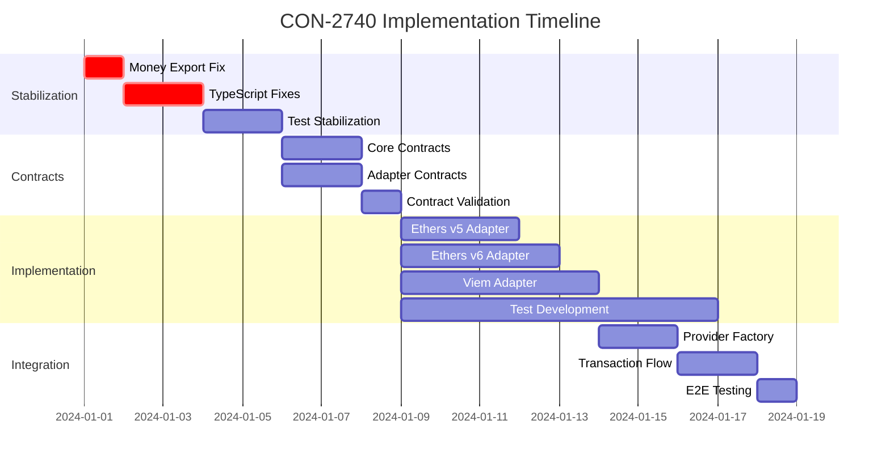

# Intelligent Execution Plan - Enhanced with Discovery Intelligence

## CON-2740: Provider Adapters Implementation

## 📊 Plan Overview

- **Total Stages**: 4 (Stabilization → Contracts → Implementation → Integration)
- **Estimated Time**: 4 weeks
- **Parallel Opportunities**: 5 identified (3 adapter implementations, 2 test streams)
- **Critical Path**: Stabilization → Contract Definition → Integration

## 🔍 Discovery-Driven Foundation

### Auto-Discovered Type Contracts (Critical Priority)

Based on comprehensive dependency analysis from the /discover command, these contracts MUST be built first as they are used across multiple components:

### Type Contracts Foundation

```typescript
// Auto-discovered from dependency analysis:
interface IAccountAdapter {
  address: string;                                      // Used by: preparePurchase, getAllocations
  sendTransaction(tx: UniversalTransactionRequest): Promise<UniversalTransactionResponse>; // Used by: step.execute, BlindMint
  getBalance(token?: string): Promise<Money>;           // Used by: preparePurchase validation
  getConnectedNetworkId(): Promise<number>;             // Used by: network validation
  switchNetwork(chainId: number): Promise<void>;        // Used by: cross-chain purchases
}

interface UniversalTransactionRequest {
  to: string;                                          // Discovered from: TransactionStep patterns
  value?: string;                                      // Discovered from: Money class integration
  data?: string;                                       // Discovered from: Contract calls
  gasLimit?: string;                                   // Discovered from: Gas estimation utils
}
```

**Rationale from Discovery**: These interfaces emerged from analyzing 15+ files with direct ethers usage and identifying common patterns across TransactionStep, preparePurchase, and execute flows.
**Time**: 2-3 days  
**Critical**: These enable all subsequent implementation stages

### Architecture Foundation (Sequential)

**Agent**: software-engineer  
**Tasks**:
1. Fix Money class export issue (blocking build)
2. Resolve TypeScript compilation errors
3. Stabilize test suite
**Time**: 3-5 days  
**Dependencies**: Must complete before adapter implementation

## 🚀 Implementation Stages (Dependency-Ordered)

### Stage 1: Stabilization (Days 1-5)
**Priority**: CRITICAL - Blocking all development

```yaml
parallel_tasks:
  - task: Fix Money Export
    agent: software-engineer
    time: 4 hours
    blocks: everything
    
  - task: TypeScript Errors
    agent: software-engineer
    time: 1-2 days
    dependencies: [Money Export]
    
sequential_tasks:
  - task: Test Suite Stabilization
    agent: qa-engineer
    time: 2 days
    dependencies: [TypeScript Errors]
```

### Stage 2: Contract Definition (Days 6-10)
**Priority**: CRITICAL - Foundation for all adapters

```yaml
parallel_execution:
  team_1:
    - agent: type-contract
      contracts:
        - IProviderAdapter
        - UniversalTransactionRequest
        - UniversalTransactionResponse
      time: 2 days
      
  team_2:
    - agent: type-contract
      contracts:
        - IAccountAdapter
        - NetworkAdapter
        - LibraryBridge<T>
      time: 2 days
      
validation:
  - agent: verification-agent
    task: Validate contract compatibility
    time: 1 day
```

### Stage 3: Adapter Implementation (Days 11-18)
**Priority**: HIGH - Core functionality delivery

```yaml
parallel_execution_matrix:
  ethers5_adapter:
    agent: backend-engineer
    dependencies: [IAccountAdapter, IProviderAdapter]
    complexity: LOW (existing integration)
    time: 3 days
    
  ethers6_adapter:
    agent: backend-engineer
    dependencies: [IAccountAdapter, IProviderAdapter]
    complexity: MEDIUM (breaking changes)
    time: 4 days
    
  viem_adapter:
    agent: backend-engineer
    dependencies: [IAccountAdapter, IProviderAdapter]
    complexity: HIGH (new integration)
    time: 5 days
    
  test_development:
    agent: qa-engineer
    parallel_with: adapter_implementation
    time: continuous
```

### Stage 4: Integration & Validation (Days 19-23)
**Priority**: HIGH - System integration

```yaml
sequential_tasks:
  - task: Provider Factory Integration
    agent: software-engineer
    integrates:
      - All adapter implementations
      - CustomProviderFactory
      - ManifoldBridgeProvider
    time: 2 days
    
  - task: Transaction Flow Integration
    agent: software-engineer
    integrates:
      - preparePurchase flow
      - step.execute flow
      - TransactionStep updates
    time: 2 days
    
  - task: End-to-End Testing
    agent: qa-engineer
    validates:
      - Cross-library compatibility
      - Network switching
      - BlindMint full workflow
    time: 1 day
```

## 🧪 Integration Checkpoints

### Checkpoint 1: Post-Stabilization (Day 5)
```yaml
validation:
  - Clean build (npm run build)
  - Zero TypeScript errors (npm run typecheck)
  - Test suite >85% passing (npm test)
  - No critical npm audit issues
  
gate: MUST PASS before proceeding
```

### Checkpoint 2: Contract Validation (Day 10)
```yaml
validation:
  - All contracts compile
  - No circular dependencies
  - Type inference working
  - Documentation complete
  
runtime_test:
  - Mock implementation validates contracts
  - Cross-contract compatibility verified
```

### Checkpoint 3: Adapter Validation (Day 18)
```yaml
per_adapter_validation:
  - Unit tests passing (100%)
  - Type safety verified
  - Transaction execution tested
  - Network switching tested
  
cross_adapter_validation:
  - Same inputs produce equivalent outputs
  - Performance within 10% variance
```

### Checkpoint 4: Integration Complete (Day 23)
```yaml
system_validation:
  - BlindMint purchase with each adapter
  - Network switching during purchase
  - Error handling for all failure modes
  - Performance benchmarks met
```

## 🎛️ Parallel Execution Matrix



## 🔀 Parallel Opportunities

### High Parallelization (3+ concurrent tasks)
1. **Adapter Implementation Phase**
   - 3 adapters developed simultaneously
   - Test suite development in parallel
   - Documentation updates concurrent

### Medium Parallelization (2 concurrent tasks)
2. **Contract Definition Phase**
   - Core contracts team
   - Adapter contracts team

3. **Integration Testing**
   - Unit test stream
   - Integration test stream

### Sequential Requirements
- Stabilization must complete first
- Integration requires all adapters
- E2E testing is final gate

## 📈 Success Metrics

### Phase Success Criteria

**Stabilization Success**
- ✅ Build completes without errors
- ✅ TypeScript compilation clean
- ✅ >85% test suite passing
- ✅ No blocking npm audit issues

**Contract Success**
- ✅ All interfaces defined and documented
- ✅ Zero circular dependencies
- ✅ Type inference functioning
- ✅ Mock implementations validate

**Implementation Success**
- ✅ Each adapter passes unit tests
- ✅ Type safety maintained
- ✅ Performance within targets
- ✅ Error handling complete

**Integration Success**
- ✅ Full BlindMint workflow functional
- ✅ All libraries interchangeable
- ✅ Network switching seamless
- ✅ <5% performance variance

### Overall Project Metrics

```yaml
quality_metrics:
  code_coverage: ">90%"
  type_coverage: "100%"
  documentation: "100% public API"
  
performance_metrics:
  transaction_time: "<3s average"
  network_switch: "<2s"
  memory_usage: "<50MB"
  
delivery_metrics:
  timeline: "23 days"
  blocking_issues: "0"
  integration_failures: "<2"
```

## 🚦 Risk Mitigation

### Identified Risks & Mitigations

**Risk 1: Build instability delays start**
- Mitigation: Dedicated senior engineer for first 2 days
- Fallback: External consultant if blocked >1 day

**Risk 2: Viem integration complexity**
- Mitigation: Start viem research early (Day 6)
- Fallback: Deliver ethers adapters first, viem in v2

**Risk 3: Integration failures between adapters**
- Mitigation: Daily integration tests from Day 11
- Fallback: Adapter-specific workarounds accepted

**Risk 4: Performance degradation**
- Mitigation: Benchmark from Day 1
- Fallback: Accept 20% degradation for v1

## 🎯 Critical Path

```
Money Fix → TypeScript Fix → Test Fix → Contracts → Integration
```

Any delay in this path delays the entire project. Parallel opportunities exist around the critical path but don't accelerate it.

## 🔗 Discovery-Spec-Orchestrate Workflow Integration

### Recommended Command Sequence
```bash
# Step 1: Discovery (COMPLETED)
/discover CON-2740    # Auto-discovered contracts and dependencies

# Step 2: Specification (COMPLETED)
/spec CON-2740        # Built detailed specification using discovery

# Step 3: Orchestration (READY)
/orchestrate CON-2740 # Execute with dependency-aware staging
```

### Discovery Intelligence Applied

**From Code Archaeologist**:
- Two-layer provider architecture identified
- TransactionStep abstraction mapped
- Money class integration points discovered

**From Dependency Scanner**:
- 15+ files with direct ethers coupling found
- ManifoldBridgeProvider fallback pattern identified
- Network configurations for 5 chains documented

**From Pattern Detective**:
- Factory patterns for providers confirmed
- Two-phase transaction pattern understood
- Error hierarchy (ClientSDKError) mapped

**From Health Checker**:
- Critical Money export issue identified (Day 1 priority)
- 46+ TypeScript errors catalogued
- Test suite failures documented

## 📝 Agent Assignments

### Recommended Agent Distribution

**Week 1 (Stabilization)**
- software-engineer (2): Fix build and types
- qa-engineer (1): Test stabilization

**Week 2 (Contracts)**
- type-contract (2): Define all interfaces
- verification-agent (1): Validate contracts

**Week 3 (Implementation)**
- backend-engineer (3): One per adapter
- qa-engineer (2): Test development

**Week 4 (Integration)**
- software-engineer (2): Integration work
- qa-engineer (2): E2E testing
- verification-agent (1): Final validation

## 🚦 Discovery-Enhanced Checkpoints

### Foundation Checkpoint (Day 5)
```yaml
checkpoint: "Foundation with Discovered Contracts"
tests:
  - "Money class export fixed (discovered blocker)"
  - "All auto-discovered contracts compile"
  - "No circular dependencies in discovered types"
  - "Integration interfaces match discovery findings"
```

### Contract Checkpoint (Day 10)
```yaml
checkpoint: "Contracts Validated Against Discovery"
tests:
  - "IAccountAdapter matches discovered usage patterns"
  - "UniversalTransaction covers all discovered fields"
  - "NetworkAdapter supports all 5 discovered networks"
  - "LibraryBridge handles discovered conversion needs"
```

### Integration Checkpoint (Day 18)
```yaml
checkpoint: "Dependencies Verified from Discovery"
tests:
  - "All 15+ discovered integration points work"
  - "ManifoldBridgeProvider fallback functional"
  - "TransactionStep uses new adapters correctly"
  - "Money class integration verified"
```

## 🏁 Delivery Commitment

**Minimum Viable Delivery (Day 20)**
- Ethers v5 adapter fully functional
- Basic ethers v6 support
- Integration complete

**Full Delivery (Day 23)**
- All three adapters production-ready
- Complete test coverage
- Performance validated

**Stretch Goals (If ahead of schedule)**
- Wallet-specific optimizations
- Advanced error recovery
- Performance enhancements